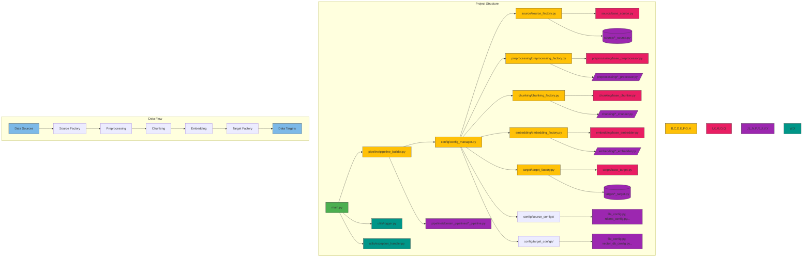

Here's a markdown file with a Mermaid diagram representing the project structure and data pipeline flow:

```markdown
# NLP ETL Pipeline Project Structure and Flow



## Diagram Explanation

1. **Project Structure**:
   - `main.py`: Entry point for pipeline execution
   - Factory pattern implementation for all major components
   - Config management with separate configurations for different sources/targets
   - Modular components for each ETL stage
   - Domain-specific pipeline implementations
   - Utility modules for logging and error handling

2. **Data Flow**:
   ```mermaid
   graph LR
       S[(Data Sources)] --> SF[Source Factory]
       SF --> PP[Preprocessing]
       PP --> CH[Chunking]
       CH --> EM[Embedding]
       EM --> TF[Target Factory]
       TF --> T[(Data Targets)]
   ```

3. **Key Components**:
   - **Factories**: Central coordinators for component creation
   - **Base Classes**: Abstract classes defining interfaces
   - **Concrete Implementations**: Specific implementations for different technologies
   - **Config Management**: Hierarchical configuration system
   - **Domain Pipelines**: Preconfigured pipelines for specific business domains

4. **Extension Points**:
   - Add new sources/targets in respective directories
   - Create new domain pipelines without modifying core logic
   - Implement additional preprocessing/chunking/embedding strategies
   - Extend configuration system for new requirements

5. **Test Coverage**:
   - Unit tests for all major components
   - Integration tests for pipeline stages
   - Configuration validation tests
   - Exception handling verification

This structure supports:
- Clean separation of concerns
- Easy maintenance and extensibility
- Configuration-driven pipeline setup
- Reusable components across different domains
- Consistent logging and error handling
``` 

This diagram combines both the project structure and data flow visualization, showing:
1. File/folder relationships in the project
2. Key architectural patterns (factory, abstract base classes)
3. Data flow through the pipeline
4. Extension points and test coverage
5. Color-coding for different component types

The Mermaid diagram helps visualize both the code organization and the actual data flow through the system while maintaining the relationships between configuration, implementation, and execution components.